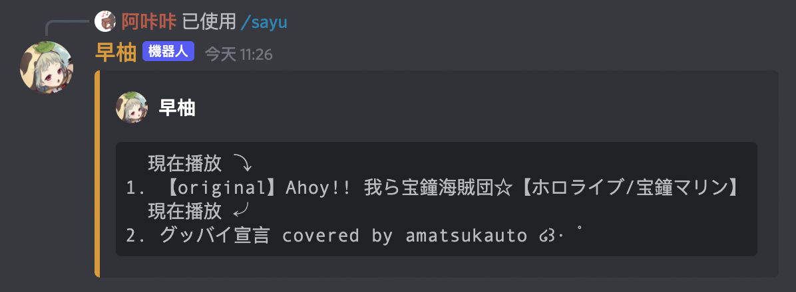

# 指令說明
這個機器人可以自訂機器人的指令前綴，以下將會以預設的前綴 `/sayu` 作為範例。

## `/sayu play <query>`
> 讓機器人進入你所在的語音頻道並播放音樂。
* `query` - YouTube 影片 ID 或網址

## `/sayu loop <mode>`
> 讓機器人依指定的模式重複播放音樂。
* `mode` - 指定重複播放的模式，選項有：
    * `none` - 不重複。
    * `track` - 單曲重複。一直重複放同首歌。
    * `queue` - 整個點歌清單重複。播完所有歌就回到第一首。

## `/sayu pause`
> 讓機器人暫停播放音樂。

## `/sayu resume`
> 讓機器人繼續播放音樂。

## `/sayu skip`
> 讓機器人跳過目前的歌曲。

## `/sayu list`
> 讓機器人列出目前的點歌清單。

## `/sayu clear`
> 讓機器人清空點歌清單。

## `/sayu jump <index>`
> 讓機器人跳到指定的歌曲。
* `index` - 清單中的第幾首歌。

## `/sayu remove <index>`
> 讓機器人移除指定的歌曲。
* `index` - 清單中的第幾首歌。